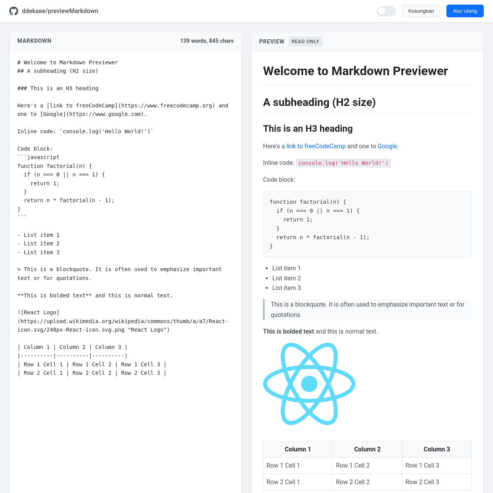

# 📝 Modern Markdown Previewer

Aplikasi **Markdown Previewer** interaktif yang dibangun dengan **React (via CDN)** dan **Marked.js**.  
Proyek ini merupakan implementasi dari [FreeCodeCamp Frontend Libraries Project](https://www.freecodecamp.org/learn/front-end-development-libraries/#front-end-development-libraries-projects).

✨ Fitur:
- Input Markdown di editor dengan **live preview**.
- Rendering **GitHub flavored Markdown** menggunakan **Marked.js**.
- Tombol **Kosongkan** dan **Atur Ulang** untuk memanipulasi editor.
- Dark mode toggle dengan **localStorage** untuk menyimpan preferensi tema.
- Hitung jumlah kata dan karakter secara real-time.
- Desain modern, responsive, dan interaktif.

---

## 🚀 Demo
👉 [Lihat Live Demo di GitHub Pages](https://ddekaee.github.io/previewMarkdown/)  

---

## 🛠️ Teknologi yang digunakan
- [React 17/18](https://react.dev/) (via CDN, tanpa build tools)
- [Marked.js](https://marked.js.org/) (Markdown parser)
- CSS custom untuk layout dan dark mode
- [Font Awesome](https://fontawesome.com/) untuk ikon GitHub
- [FreeCodeCamp Test Suite](https://cdn.freecodecamp.org/testable-projects-fcc/v1/bundle.js)

---

## 📸 Preview


---

## 📦 Cara Menjalankan
1. Clone repo ini:
   ```bash
   git clone https://github.com/ddekaee/previewMarkdown.git
2. Buka file index.html di browser.

3. Selesai ✅
